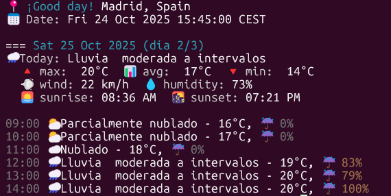

# go CLIweather
<br><br>

# 1. Introduction
This is a Golang project where you can use a CLI to gather information from WeatherAPI about the forecast of your current location.

Let's start explaining the commands that the CLI have:
- **root**: By default, there are two options for users to configure various visual aspects of the forecast:
    - **no-color**: User can choose between colorful or plain information. By default, info will be with colors. In case you want switch off colors:
        ```
        cliweather --no-color forecast
        ```
    - **no-emoji**: Same case as before but this time you can decide if you want emojis or not. By default, emojis are on, but if you want to disable them:
        ```
        cliweather --no-emoji forecast
        ```
<br><br>
- **completion**: This command is designed to generate shell autocompletion scripts for various shells: **Bash**, **Zsh** and **Fish**. This improves the user experience by enabling tab-completion for commans, flags and args. Example of use:
    ```
    cliweather completion bash
    ```
    There si no need to add double dashes, just put directly the terminal you want.
<br><br>

- **version**: This command shows the user the current version of the executed binary:
    ```
    cliweather version
    ```
<br><br>
- **forecast**: This command will display the information about the forecast of the city you want. These are the flags that the user will have to configure:
    - **city**: Specify the name of the city you want to know the information. Example:
        ```
        cliweather forecast --city Madrid
        ```
    - **days**: Specify the number of days for which you want to know the weather forecast. By default, the number of days is set to 1 and the WeatherAPI normal account only allows up to 3 days free. Example:
        ```
        cliweather forecast --city Madrid --days 3
        ```
    - **lang**: Specify the language you want the info to be displayed. By default is set to english. Example:
        ```
        cliweather forecast --city Madrid --days 3 --lang es
        ```
    - **apikey**: If you already updated the API key in .env file, this flag is optional but if is not the case, you will just have to use this flag and specify the apikey and automatically it will be uploaded in the .env file.
    - **debug**: It print the row struct in case you want to debug. By default is set to false.
    - **day-index**: In case you added before in the **days** flag a value, with this new flag you can choose which all the days you want exactly. By defult, it is set to -1, so it will displays the info of the last day. For example, let's say you want to see the forecast for only the second day:
        ```
        cliweather forecast --city Madrid --days 3 --lang es --day-index 1
        ```
    - **json**: Set this flag to **True** in case you want to see printed the response in raw JSON format.
    - **units**: This flag will shows the info units according to the value you inserted. By default, units are set in Celsius.
    - **hours**: You can select wich specific hour range you want to see the forecast. For example, you want to see the weather from 9 AM to 2 PM:
        ```
        cliweather forecast --city Madrid --days 3 --lang es --day-index 1 --hours 09-14
        ```

    Eventually, if I execute this final command, the result may look like this:
<br><br>
    

<br><br>
<br><br>

## How to reproduce
In case you want to do some modifications in the code or just reproduce the generation of the binary, you will just have to follow these setps:
1. Install go version 1.24.7 according to your operative system.
    - After installation you can check the version with this command:
        ```
        go version
        ```
2. Install al dependencies withÑ
    ```
    go mod tidy
    ```
3. Please be aware that my current binary is in a **Linux amd**